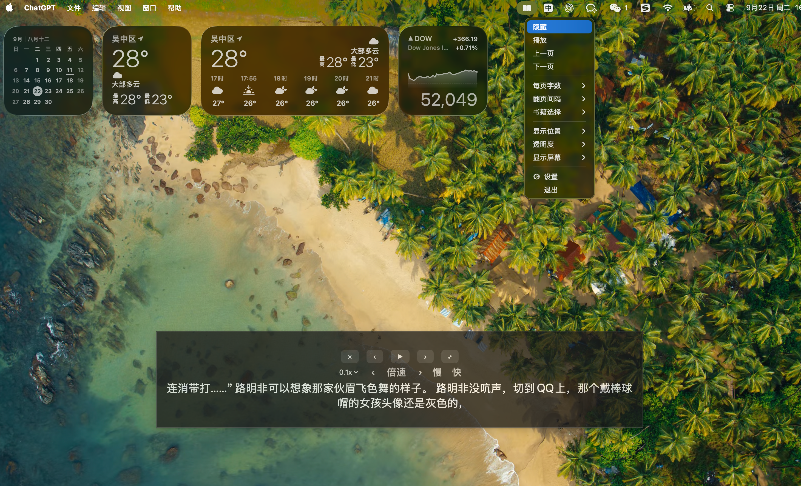
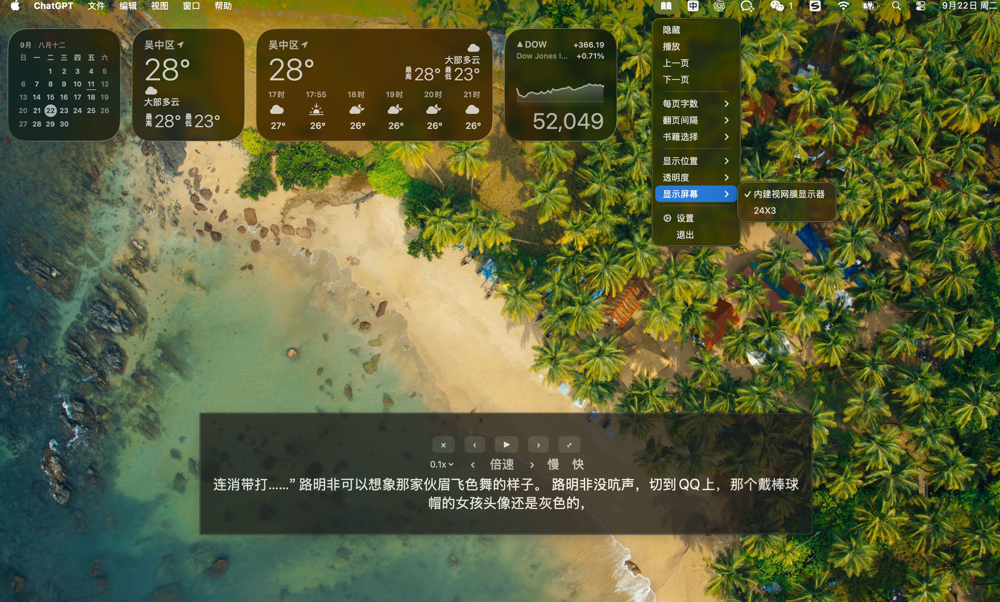
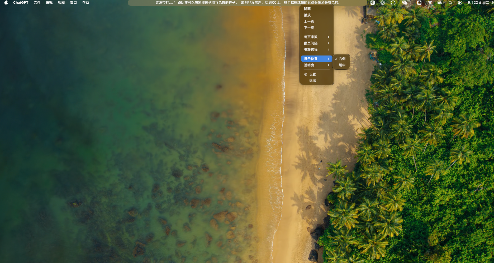
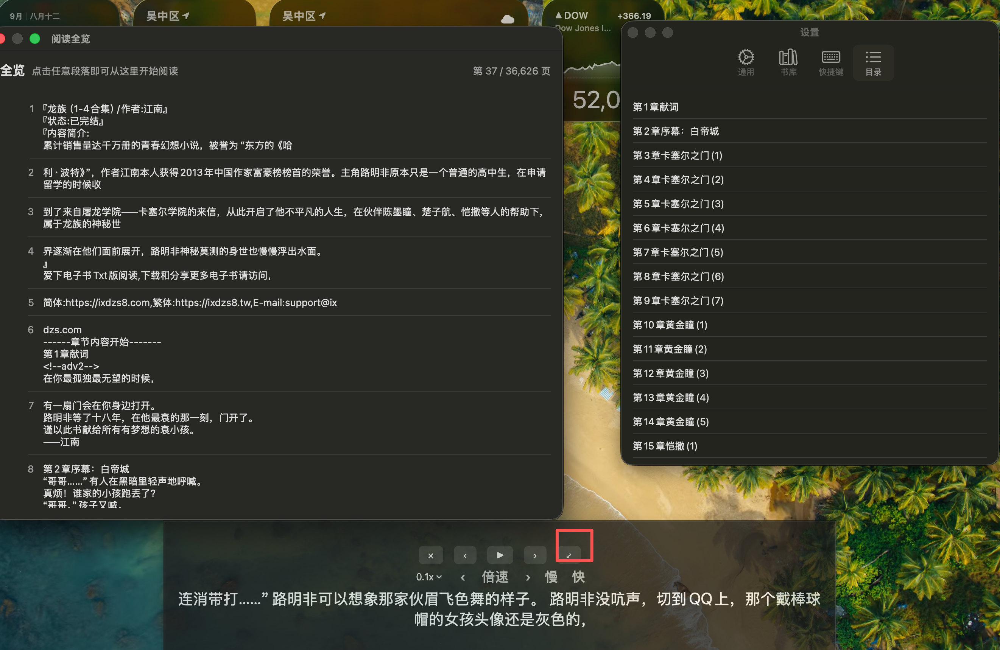

# QuietReader

QuietReader 是一个 macOS 菜单栏小说阅读器，支持 TXT 导入、悬浮阅读、自动翻页、逐字高亮和阅读进度记忆。

## 功能

- 导入本地 UTF-8 TXT 小说
- 菜单栏与可拖动悬浮窗阅读
- 播放、暂停、上一页、下一页
- `0.001x` 到 `16x` 的连续倍速调节
- 播放时逐字高亮，速度与倍速同步
- 自动识别章节目录并快速跳转
- 全览窗口：点击任意页后从该位置开始阅读
- 记住当前书籍、章节和阅读位置
- 支持透明度、字号和显示位置调整

## 功能演示

### 菜单栏悬浮阅读

应用常驻 macOS 菜单栏，菜单中集中提供播放、翻页、每页字数、翻页间隔、书籍切换、显示位置、透明度和显示屏幕等控制。



### 指定显示器

如果连接了外接显示器，可以在“显示屏幕”菜单中选择“内建视网膜显示器”或外接屏，避免悬浮窗同时出现在两台显示器上。



外接屏也支持独立显示悬浮阅读窗，适合把阅读窗口放在指定的工作区域。



### 播放与逐字高亮

点击播放后，文字会按照当前播放速度逐字变为高亮颜色；调整倍速时，染色进度也会同步变慢或加快，当前页完成后自动进入下一页。


### 书库与阅读进度

“书库”页面会显示已导入的 TXT 文件、当前阅读页数和总页数。应用会保存当前书籍与阅读进度，下次启动可以继续上次的位置。


### 章节目录

“目录”页面会自动识别 TXT 中的章节标题。点击章节即可快速跳转到对应章节，不需要反复点击下一页查找。


### 全览与行级定位

点击悬浮窗上的展开按钮，会打开“阅读全览”窗口。选择章节后，可以继续查看该章节的分页内容，点击任意一行或段落即可从那里开始阅读和播放。



## 系统要求

- macOS 13 Ventura 或更高版本
- Apple Silicon Mac（当前构建目标为 arm64）
- Xcode Command Line Tools 或 Xcode

## 构建 macOS 应用

```bash
chmod +x build.sh
./build.sh
open build/MenuReader.app
```

生成 DMG 安装包：

```bash
./build-dmg.sh
open build/QuietReader-1.0.0.dmg
```

首次打开时，把应用拖入 `Applications` 文件夹即可。由于应用未使用 Apple Developer ID 签名，macOS 若提示无法打开，可在“系统设置 → 隐私与安全性”中允许打开。

## 使用

1. 启动应用，点击菜单栏图标并导入 TXT。
2. 选择“居中”显示模式打开悬浮窗。
3. 点击 `▶` 开始自动阅读。
4. 点击倍速数值选择档位，或用 `‹ / ›` 将速度减半或加倍。
5. 点击 `⤢` 打开全览窗口，点击任意页面后从该处继续。
6. 在“设置 → 目录”中按章节跳转。

### 悬浮窗按钮

- `×`：隐藏悬浮窗
- `‹ / ›`：上一页 / 下一页
- `▶`：开始或暂停自动播放
- 倍速数值：选择预设倍速
- 倍速旁的 `‹ / ›`：将当前倍速减半或加倍
- `慢 / 快`：逐档调整播放速度
- `⤢`：打开全览窗口，点击任意页面后从该页开始播放

### 菜单栏功能

点击菜单栏中的 QuietReader 图标，可以导入或切换 TXT、设置每页字数、调整显示模式和透明度、打开设置、目录与退出应用。阅读位置会自动保存，下次打开会恢复到上次位置。

## Windows

当前版本依赖 macOS 的 AppKit、SwiftUI 和菜单栏 API，不能直接生成 Windows `.exe`。Windows 版本需要使用 Windows 原生 UI 或跨平台框架重新实现；发布页面不会提供一个无法运行的伪 `.exe`。

## 项目来源与二次开发说明

本项目基于 [zhiyozhao/menu-reader](https://github.com/zhiyozhao/menu-reader) 进行二次开发。感谢原作者提供的基础项目与实现思路。

本仓库主要增加和调整了悬浮阅读窗口、TXT 阅读体验、倍速控制、逐字高亮、章节目录、全览定位、阅读进度恢复和 macOS 打包流程。使用、修改和再分发时，请同时遵守原项目及其依赖项的许可证要求，并保留原作者的版权与许可声明。

## 免责声明

- 本项目仅提供本地文本阅读和显示功能，不提供小说搜索、下载、书源或任何版权内容。
- 用户应确保导入、阅读、复制和分享的文件拥有合法来源或已获得必要授权。
- 作者不对用户使用本软件阅读、保存或传播未经授权的内容承担责任。
- 本项目按“现状”提供，不保证在所有 macOS 版本、硬件、编码格式或第三方依赖环境下始终正常运行。
- 未签名的 macOS 应用可能触发系统安全提示，用户应自行判断是否信任并运行。

## 版权与使用

本项目只负责阅读用户拥有或有权使用的本地文件，不提供或分发未经授权的小说内容。

## License

MIT License
